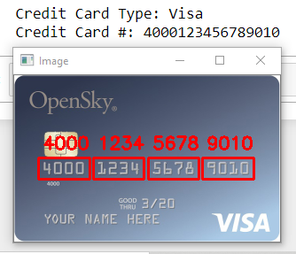

# Credit Debit Card OCR

This model will tell us credit card number when you will give image to this OCR. When someone is doing their some payment he has not debit or credit card physically but he have an image of that so that by applying this model he will get the card details or suppose OCR is applied on the payment gateway then it is more efficient.

**Output**

### Algorithm :

* First we have a reference image of a Credit Card. So this says that all images that to be inserted in OCR are in that size or shape.
